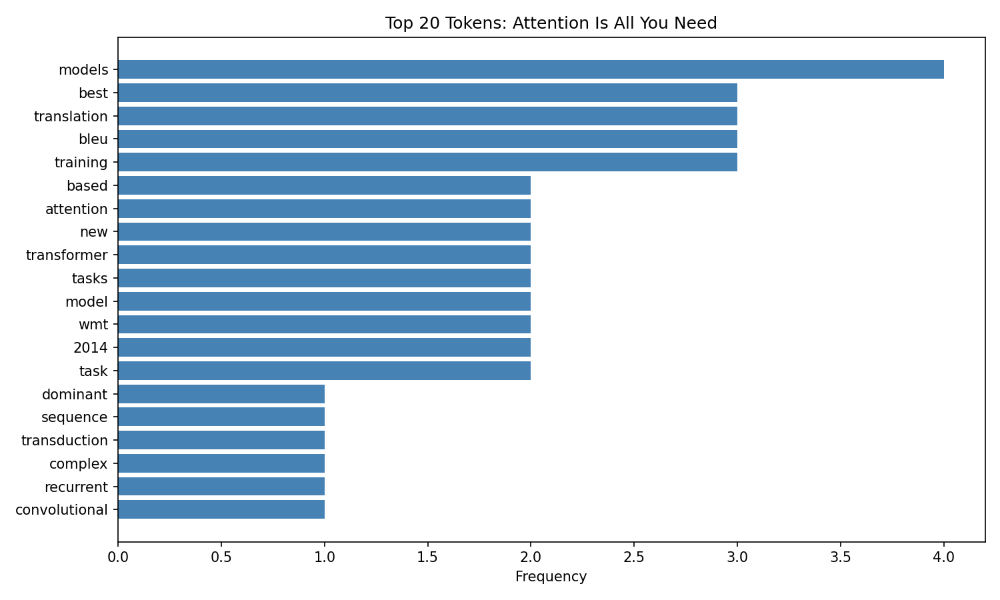
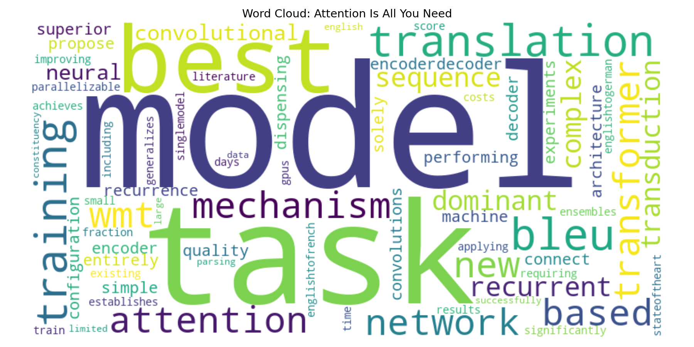
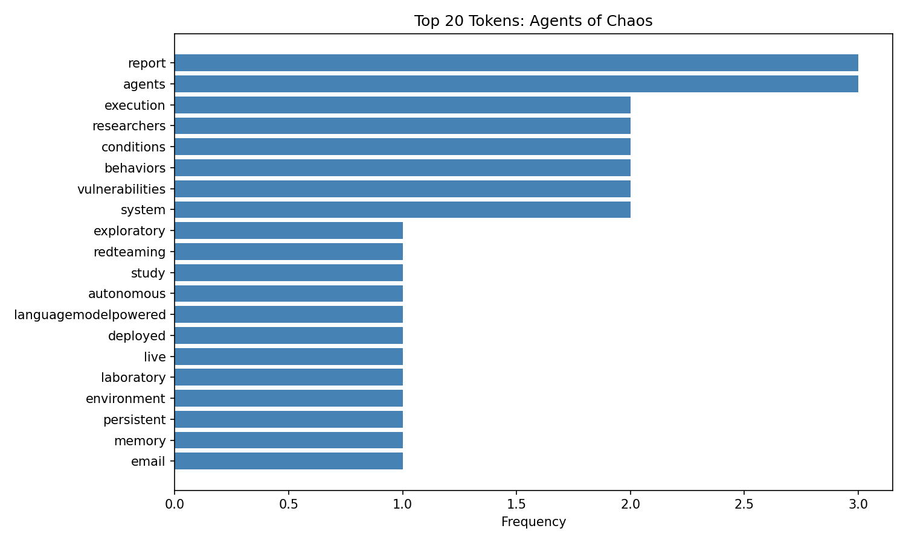
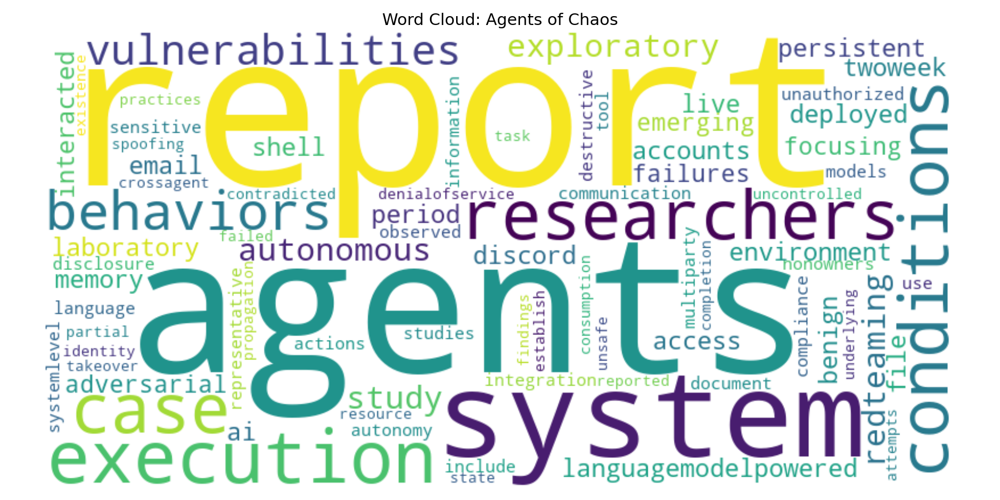

# NLP Portfolio — Venkat Teja Nallamothu

**Web Mining and Applied Natural Language Processing**

Northwest Missouri State University · 2026

---

## 1. NLP Techniques Implemented

Across six modules, I implemented a full progression of NLP techniques — starting from environment setup and word clouds through multi-stage EVTAL pipelines with frequency analysis and lexical feature engineering.

| Technique | Module(s) | Implementation Detail |
|---|---|---|
| **Environment setup & tooling** | nlp-01 | Configured spaCy `en_core_web_sm`, virtual environment, and Jupyter notebooks |
| **Word cloud generation** | nlp-01, nlp-02 | Frequency-weighted visual output using the `wordcloud` library |
| **Tokenization** | nlp-02, nlp-03, nlp-06 | Word-level splitting via spaCy tokenizer and `str.split()` |
| **Text normalization** | nlp-02, nlp-06 | Lowercasing (`str.lower()`), punctuation removal (`str.maketrans()`), whitespace collapse (`re.sub(r'\s+', ' ', ...)`) |
| **Stopword removal** | nlp-02, nlp-06 | Filtered using spaCy `token.is_stop`; reduced abstract token counts by ~40% |
| **Frequency analysis** | nlp-03, nlp-06 | Unigram counts via `collections.Counter`; top-20 rankings logged and visualized |
| **Co-occurrence / bigram analysis** | nlp-03 | Context-window co-occurrence and bigram frequency across a structured multi-category corpus |
| **Corpus exploration** | nlp-03 | Token comparisons across categories (dog, cat, truck, car); global vs. per-category token rankings |
| **JSON API extraction** | nlp-04 | EVTL pipeline against `jsonplaceholder.typicode.com/posts`; raw JSON → validated → structured CSV |
| **HTML web scraping** | nlp-05, nlp-06 | BeautifulSoup tag selectors (`h1.title`, `div.authors`, `blockquote.abstract`, `div.dateline`) on arXiv pages |
| **Metadata extraction** | nlp-05 | Extracted `sentence_count`, `avg_word_length`, `author_count`, PDF URL, version count from arXiv HTML |
| **Type-token ratio (TTR)** | nlp-06 | `unique_tokens / total_tokens`; 0.798 for *Attention Is All You Need*, 0.917 for *Agents of Chaos* |
| **Feature engineering** | nlp-05, nlp-06 | Derived `abstract_word_count`, `token_count`, `unique_token_count`, `type_token_ratio`, `author_count` |
| **Visualization** | nlp-01, nlp-06 | Horizontal bar charts (matplotlib) and word clouds (viridis colormap, 800×400px) |

---

## 2. Systems and Data Sources

| Module | Source | Format | What Was Analyzed |
|---|---|---|---|
| nlp-01 | Web content | HTML | General web text; first spaCy word cloud |
| nlp-02 | Local text files | Plain text | Text records in `data/`; preprocessing pipeline |
| nlp-03 | Structured corpus | Plain text | Multi-category corpus (dog, cat, truck, car) for comparative token analysis |
| nlp-04 | JSONPlaceholder API (`/posts`) | JSON | 100 synthetic post objects; validated field structure before CSV export |
| nlp-05 | arXiv — *Disentangling cosmic distance tensions* (2604.08530) | HTML | Academic abstract; sentence count, avg word length, metadata fields |
| nlp-06 | arXiv — *Attention Is All You Need* (1706.03762) + *Agents of Chaos* (2602.20021) | HTML | Full EVTAL pipeline; token frequency, TTR, visualizations |

**Handling variable structure:**
- JSON APIs required null-safe key traversal for optional fields
- HTML pages required structural validation before extraction to prevent silent field corruption (missing `div.authors` or `blockquote.abstract`)
- Plain text required whitespace normalization to remove HTML-encoded artifacts before tokenization

---

## 3. Pipeline Structure (EVTL)

Every module from nlp-04 onward followed an explicit EVTL or EVTAL architecture. The nlp-06 pipeline is the most complete implementation:

```
Extract → Validate → Transform → Analyze → Load
```

| Stage | File | Source → Sink |
|---|---|---|
| **Extract** | `stage01_extract.py` | HTTP GET with custom `User-Agent` headers → `data/raw/teja_raw.html` |
| **Validate** | `stage02_validate_teja.py` | Raw HTML → BeautifulSoup; checks `h1.title`, `div.authors`, `blockquote.abstract`, `div.subheader`, `div.dateline` |
| **Transform** | `stage03_transform_teja.py` | Validated soup → Pandas DataFrame; raw extraction (3.1), text cleaning (3.2), feature engineering (3.3) |
| **Analyze** | `stage04_analyze_teja.py` | DataFrame → `teja_top_tokens.png`, `teja_wordcloud.png`; frequency table to `project.log` |
| **Load** | `stage05_load.py` | DataFrame → `data/processed/teja_processed.csv` (13 columns) |

Configuration is separated into `config_case.py` and `config_teja.py` — each defines `PAGE_URL`, request headers, and output paths — so the same pipeline logic runs against different sources without code changes.

**Earlier pipeline evolution:**

| Module | Pipeline Type | Key Addition |
|---|---|---|
| nlp-04 | EVTL (JSON) | First structured pipeline; JSON API → validated fields → CSV |
| nlp-05 | EVTL (HTML) | HTML scraping added; richer metadata extraction |
| nlp-06 | EVTAL (HTML) | Analyze stage added; spaCy NLP features + visualizations |

---

## 4. Signals and Analysis Methods

### Word Frequency (Unigram)
`collections.Counter` on cleaned token lists. For *Attention Is All You Need*, top tokens were `transformer`, `attention`, `translation`, `models`, `bleu` — accurately reflecting the paper's contribution from abstract text alone.

### Type-Token Ratio (TTR)
Measures lexical diversity: `unique_tokens / total_tokens`

| Paper | Raw Words | Clean Tokens | Unique Tokens | TTR |
|---|---|---|---|---|
| *Attention Is All You Need* | 166 | 99 | 79 | **0.798** |
| *Agents of Chaos* | 177 | 121 | 111 | **0.917** |

The higher TTR for the red-teaming paper reflects its broader vocabulary spanning AI safety, agent behavior, and evaluation methodology.

### Token Reduction Rate
The cleaning pipeline (lowercase → punctuation removal → stopword filter) reduced raw word counts by **~40–45%**, isolating content-bearing tokens.

### Co-occurrence and Bigrams (nlp-03)
Context-window analysis identified which tokens appeared together most frequently within the multi-category corpus, producing category-level association patterns beyond simple frequency ranking.

### Metadata Signals (nlp-05)
`avg_word_length`, `sentence_count`, and `author_count` were engineered as structured document-level features alongside text content, enabling comparison across papers without reading the full text.

---

## 5. Visualizations

### Word Cloud — nlp-01: First spaCy Word Cloud


First word cloud generated from web-sourced text using spaCy `en_core_web_sm` and the `wordcloud` library. Established the baseline visualization workflow used in all later modules.

---

### Word Cloud — nlp-02: Text Preprocessing Output


Word cloud produced after the full preprocessing pipeline (tokenization → lowercasing → punctuation removal → stopword filtering). Visually confirms that cleaning removes grammatical noise and surfaces content-bearing tokens.

---

### Word Cloud — nlp-03: Corpus Exploration


Word cloud from the multi-category corpus (dog, cat, truck, car). Token size reflects frequency across the full corpus; category-level analysis revealed per-domain signals hidden in the global view.

---

### Token Frequency — *Attention Is All You Need* (arXiv 1706.03762)



Top tokens confirm the paper's focus: `transformer`, `attention`, `translation`, `models`, and `bleu` dominate after stopword removal.

---

### Word Cloud — *Attention Is All You Need*



Frequency-weighted word cloud generated from the cleaned abstract using viridis colormap (800×400px).

---

### Token Frequency — *Agents of Chaos* (arXiv 2602.20021)



Top tokens reflect the red-teaming and AI safety focus: `agents`, `llm`, `attack`, `safety`, `autonomous`.

---

### Word Cloud — *Agents of Chaos*



The broader, more varied vocabulary (TTR 0.917) is visible in the word cloud's wider spread of similarly-sized terms compared to the Attention paper.

---

## 6. Insights

**Cleaning reveals signal, not noise.**
Reducing *Attention Is All You Need*'s abstract from 166 raw words to 99 clean tokens surfaced `transformer` and `attention` as top terms — no labels needed.

**TTR distinguishes domain breadth.**
A TTR of 0.917 vs. 0.798 reflects the red-teaming paper's wider scope. A single ratio captures vocabulary diversity across two very different research areas.

**Metadata encodes structure.**
*Agents of Chaos* has 38 authors vs. 8 for *Attention*. Author count as a structured feature captures collaboration scale without parsing text.

**Validation prevents silent failures.**
The validate stage in nlp-06 caught edge cases in whitespace encoding and tag nesting that would have silently corrupted extracted fields. Structural checks are not optional in real pipelines.

**Pipelines are reusable.**
Separating `config_case.py` from `pipeline_web_html.py` meant running the same pipeline against two different arXiv papers required only a config file swap — no code changes.

**Corpus structure shapes frequency results.**
In nlp-03, category-level token rankings (dog, cat, truck, car) showed that global frequency rankings can obscure domain-specific signals invisible without segmentation.

---

## 7. Representative Work — All Modules

### [nlp-01: Environment Setup & First Word Cloud](https://github.com/vnallam09/nlp-01)
Configured the Python NLP environment with spaCy (`en_core_web_sm`), virtual environment, and Jupyter notebooks. Produced the first word cloud visualization from web-sourced text. Foundational to all subsequent modules.

### [nlp-02: Text Preprocessing Pipeline](https://github.com/vnallam09/nlp-02)
Built a tokenization and normalization pipeline: lowercasing, punctuation removal, whitespace normalization, and spaCy-based stopword filtering applied to local text files. First structured preprocessing workflow.

### [nlp-03: Corpus Exploration & Bigram Analysis](https://github.com/vnallam09/nlp-03)
Applied frequency analysis, context-window co-occurrence, and bigram ranking to a structured multi-category corpus. Demonstrated how corpus segmentation reveals signals that global ranking hides.

### [nlp-04: EVTL Pipeline — JSON API](https://github.com/vnallam09/nlp-04)
First full EVTL pipeline: fetched 100 posts from a public JSON API, validated field structure, transformed into a Pandas DataFrame, and exported to CSV. Established the repeatable pipeline pattern used in later modules.

### [nlp-05: HTML Scraping & Metadata Extraction](https://github.com/vnallam09/nlp-05)
Extended the EVTL pipeline to HTML: scraped an arXiv abstract page, extracted 13 structured fields (`sentence_count`, `avg_word_length`, `author_count`, PDF URL, version count), and exported to CSV. First HTML-based pipeline.

### [nlp-06: Full EVTAL Pipeline with NLP Feature Engineering](https://github.com/vnallam09/nlp-06)
The most complete implementation — five-stage EVTAL pipeline applied to two arXiv papers. Adds spaCy-based NLP, type-token ratio, token frequency bar charts, and word cloud visualizations. Demonstrates modular, config-separated, multi-source pipeline design.

---

## 8. Skills

**Python data processing**
Built structured pipelines with Pandas DataFrames; used `collections.Counter` for frequency analysis; engineered derived features (`TTR`, `token_count`, `author_count`) from raw text.

**spaCy NLP processing**
Applied `en_core_web_sm` for tokenization, stopword filtering, and linguistic annotation across multiple modules.

**Web scraping and HTML extraction**
Fetched HTML with `requests` using custom headers; navigated tag hierarchies with BeautifulSoup; validated structural expectations before extraction.

**JSON API integration**
Consumed public REST APIs; handled null-safe key traversal and variable field presence; structured output into reproducible CSV format.

**Corpus and frequency analysis**
Computed unigram frequency, bigrams, co-occurrence windows, and type-token ratio; interpreted results across different domain vocabularies.

**Handling messy or inconsistent inputs**
Normalized HTML-encoded whitespace, multi-author strings, and variable field presence using regex and BeautifulSoup fallbacks.

**Repeatable pipeline design**
Separated configuration from stage logic to enable multi-source execution; logged every stage with explicit source → process → sink documentation.

**Communicating results with Markdown and visuals**
Produced matplotlib bar charts and word cloud PNGs as deliverable artifacts; documented pipelines in `docs/index.md`, `docs/glossary.md`, and `docs/nlp-evolution.md`.

---

*Repository: [vnallam09/nlp-06](https://github.com/vnallam09/nlp-06) · Northwest Missouri State University · 2026*
